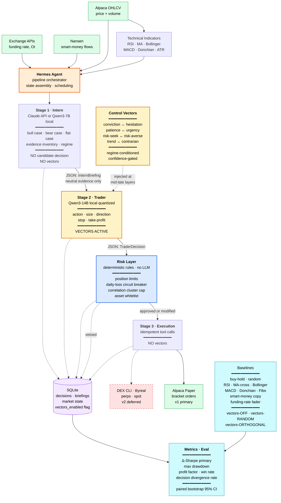

# XIANVEC — Architecture

> AI trading agent with control-vector-shaped disposition. Hackathon scope: prove that disposition-encoding control vectors meaningfully change trading behavior versus a vectors-off baseline of the same agent on the same setups.

---

## 1. Thesis

Successful traders carry embodied expertise — pattern recognition, emotional calibration, intuitive risk sense — that does not survive abstraction into rules. The hypothesis under test: **control vectors are the mechanism to encode this dispositional knowledge directly into a model's inference geometry.** Disposition is shaped geometrically; episodic memory is retrieved textually. They are complementary, not interchangeable.

The hackathon claim is narrower than the long-term thesis. We are not yet claiming the agent can self-improve from its own trades (that is the deferred Karpathy loop). The hackathon claim is:

> On a fixed set of trading setups, the same agent with disposition control vectors active outperforms the same agent with vectors disabled on a pre-committed risk-adjusted return metric, statistically beyond noise.

Everything in this document is in service of evaluating that one claim cleanly.

---

## 2. System overview

A four-stage pipeline with two named LLM roles: **Intern** (Stage 1) and **Trader** (Stage 2). The Intern prepares neutral, balanced evidence — bull case, bear case, flat case, signal inventory, regime — but commits to no action. The Trader receives the briefing and produces the actual decision, with disposition control vectors active on its hidden states. Vectors live in exactly one place. The risk layer between the Trader and the Execution stage is deterministic code, no model in the loop.

```
                 ┌────────────────┐
   Setup ──────► │  Stage 1       │  Intern
                 │  Intern        │  • neutral evidence prep
                 │  (no vectors)  │  • bull/bear/flat cases
                 └───────┬────────┘  • NO candidate decision
                         │ Briefing (JSON)
                         ▼
                 ┌────────────────┐
                 │  Stage 2       │  Trader (the experiment)
                 │  Trader        │  • local quantized model
                 │  (vectors ON)  │  • makes the actual call
                 └───────┬────────┘
                         │ Decision JSON
                         ▼
                 ┌────────────────┐
                 │  Risk Layer    │  Deterministic veto
                 │  (rules code)  │  • position/loss/whitelist limits
                 └───────┬────────┘
                         │ Approved decision (or veto)
                         ▼
                 ┌────────────────┐
                 │  Stage 3       │  Execution
                 │  Execution     │  • Alpaca paper API
                 │  (no vectors)  │  • strict tool calls only
                 └────────────────┘
```

Why the split is structured this way: a previous draft had the Intern emit a candidate direction and size. That made Stage 2 a calibrator in disguise — vectors could only nudge sizing because the textual prompt had already committed Stage 2 to the Intern's recommendation. Vectors operate on hidden-state geometry; prompt conditioning operates on token attention. The latter generally wins. To give vectors real room to drive the decision, the Intern must hand off *evidence*, not *recommendations*. Bull case / bear case / flat case is symmetric by construction. The Trader sees balanced inputs and the disposition vectors get clean influence over what the model actually decides.

Vectors cannot influence tool call formatting, schema enforcement, or risk rules. They only shape the decision content emitted by the Trader. Schema validation guarantees output shape; the risk layer guarantees safety. Vectors are free to express disposition within those bounds.

### 2.1 Full system diagram

Renders inline on GitHub. Standalone source: `architecture-diagram.mermaid`. Yellow blocks indicate where control vectors are active; blue is deterministic rule code; green is external services; purple is storage; red dashed is deferred to v2.



---

## 3. Stage 1 — Intern

**Purpose:** Produce a structured, neutral evidence briefing. The Intern researches; it does not recommend. The output is symmetric by construction so the Trader's vectors get clean steering room.

**Model choice:** Two options, picked at runtime via config.
- **Cloud:** Anthropic Claude API (`claude-haiku-4-5` for speed, `claude-sonnet-4-6` for higher-quality analysis). Faster and broader knowledge than any local 14B.
- **Local:** Qwen3-7B via llama.cpp/MLX. Used when running fully air-gapped or for cost containment in long backtests.

**Input:** Market state object containing technical indicators (RSI, MAs, Bollinger, ATR, recent OHLCV), onchain signals (Nansen smart money flows, funding rate, exchange flows for the asset), and current portfolio state (open positions, unrealized P&L, available capital).

No news, no fundamentals (out of scope by user decision).

**Output (JSON):**

```json
{
  "setup_id": "uuid",
  "asset": "BTC-PERP",
  "bull_case": "strongest argument for going long",
  "bear_case": "strongest argument for going short",
  "flat_case": "strongest argument for sitting this one out",
  "evidence_long": ["rsi_oversold", "smart_money_inflow", "funding_rate_neg"],
  "evidence_short": ["volume_declining", "lower_high_lower_low"],
  "evidence_flat": ["chop_in_5pct_range_3d", "low_signal_quality"],
  "regime": "trending | choppy | high_vol | low_vol",
  "signal_quality": 0.62,
  "horizon_hours": 4
}
```

The Intern's prompt explicitly instructs: *"Present balanced cases on all three sides. Do not recommend an action. Your job ends with the briefing — the Trader will decide."* No `candidate_direction` field, no `candidate_size_bps`. Those would commit the decision before vectors get to express disposition.

`signal_quality` is the analyst's estimate of *how clean the setup is* — a quality signal, not a directional signal. It feeds into the confidence-gating mechanism (§7.3), where low-quality setups dampen vector magnitude so vectors don't push the model into confidently-wrong territory on noisy inputs.

`regime` drives the choice of disposition weights at the Trader (regime-conditioned vector configuration, §7.4) and is itself directionally neutral — knowing the market is "choppy" doesn't tell you which way it'll resolve.

This object is the contract between Intern and Trader. It is validated by Pydantic before handoff.

---

## 4. Stage 2 — Trader

**Purpose:** Make the final trading decision, shaped by the agent's current dispositional state via active control vectors. This is where the experiment lives.

**Naming:** "Trader" replaces earlier candidates ("Stance," "Decision Agent"). The role is characterological — this model carries the disposition. The Intern hands it neutral evidence; the Trader decides.

**Model choice:** Qwen3-14B at Q4_K_M quantization is the primary candidate. Stretch target: Qwen3-32B or 36B at Q3_K_M / Q2_K depending on memory headroom. Larger models give cleaner dispositional axis separation in vector extraction; the tradeoff is that heavy quantization adds noise to hidden states and may degrade vector effects unpredictably. **A one-day spike (Phase 0, Task 2) validates vector behavior on toy axes before committing the architecture to a specific model.**

**Inference path:**
1. Receive Intern Briefing JSON.
2. Render the briefing as a prompt that requests a structured decision. The prompt presents bull/bear/flat cases in parallel structure with no anchored recommendation.
3. Run forward pass with control vectors injected at selected layers (mid-to-late, per SEAL findings).
4. Parse output as JSON via constrained generation (grammar-constrained or schema-validated with retry).

**Output (JSON):**

```json
{
  "setup_id": "uuid",
  "action": "buy | sell | flat | close",
  "size_bps": 75,
  "direction": "long | short | flat",
  "stop_loss_pct": 2.5,
  "take_profit_pct": 5.0,
  "trader_summary": "string — one-line dispositional rationale",
  "active_vectors": {"conviction": 0.8, "patience": -0.3, "risk_appetite": 0.5}
}
```

`active_vectors` is logged for offline analysis — it records which dispositional axes were applied and at what magnitude during this decision.

**Vectors-off mode:** The same code path runs with all vector magnitudes set to 0. This is the experimental control. A single config flag toggles it.

---

## 5. Risk Layer

**Purpose:** Deterministic safety net between Stage 2 and Stage 3. No LLM, no vectors. Pure rule evaluation.

The risk layer either passes the decision through unchanged, modifies sizing downward, or vetoes the decision entirely. It never increases size or flips direction.

**Rules (initial set):**
- **Max position size:** No single position larger than 20% of portfolio NAV.
- **Max total exposure:** Sum of absolute position sizes ≤ 100% of NAV (no leverage in v1; perps come later).
- **Asset whitelist:** Only assets in `config/whitelist.yaml` are tradeable.
- **Daily loss circuit breaker:** If realized + unrealized loss for the day exceeds 5% of starting NAV, all new entries are vetoed until rollover.
- **Max open positions:** ≤ 5 concurrent positions.
- **Correlation cap:** No more than two positions in the same correlation cluster (BTC-cluster, ETH-cluster, SOL-cluster).
- **Stop loss required:** Every entry must specify a stop loss; reject decisions that omit it.

**Output:** `RiskDecision { approved: bool, original: Decision, modified: Decision | None, veto_reason: str | None }`

The risk layer logs every veto with reason. Vetoes are valuable signal — they tell us when vectors push the agent into regions a human risk manager would also reject.

---

## 6. Stage 3 — Execution

**Purpose:** Translate approved decisions into Alpaca paper trading API calls. No model in the loop.

**Library:** `alpaca-py` SDK.

**Operations supported:**
- Submit market order (entry).
- Submit bracket order (entry + stop + take-profit).
- Close position.
- Query portfolio state.

**Idempotency:** Each decision carries a `setup_id` used as client order ID to prevent duplicate execution if Stage 3 is retried.

**State sync:** Portfolio state is read from Alpaca after every action and cached for the next Stage 1 input.

Alpaca paper is primary for v1. Byreal/RealClaw integration is deferred to v2 once the loop is validated end-to-end on paper.

---

## 7. Control vector strategy

### 7.1 Disposition axes (initial set)

Four bipolar axes, extracted independently and composable at inference time.

| Axis | Pole A | Pole B |
|---|---|---|
| Conviction | Hesitant, hedged | Decisive, committed |
| Patience | Urgent, act-now | Patient, wait-for-better |
| Risk appetite | Risk-averse | Risk-seeking |
| Trend disposition | Contrarian | Trend-following |

Each axis becomes a steering vector via contrastive pair extraction. At inference time, the active vector is a linear combination weighted by the current configuration.

### 7.2 Extraction approach

**v1 (hackathon):** Synthetic contrastive prompts with `repeng`. For each axis, generate ~50-100 prompt pairs of the form "respond as a [pole A] trader analyzing X" vs "respond as a [pole B] trader analyzing X." Extract the difference of mean activations across paired hidden states at mid-to-late layers. This is the classical control-vector approach.

**v2 (post-hackathon):** SVF-style context-conditional steering. Replace each global vector with a small differentiable concept-scoring function whose gradient at the current activation defines the local steering direction. Addresses the unsteerable-context problem flagged in the SVF paper. Requires more engineering and is deferred until v1 demonstrates measurable effect.

**v3 (the Karpathy reach):** Reasoning-trace contrasts à la SEAL. Use chains-of-thought from successful versus unsuccessful trades as the contrastive signal, training vectors that capture *how the model actually reasons* when correctly cautious rather than *how it talks* when prompted to be cautious. This is the self-improvement loop. Out of scope for hackathon.

### 7.3 Confidence-gated application (Glamin-inspired)

A single global vector applied at constant magnitude is fragile — when the model is already uncertain, adding a steering vector can amplify the wrong direction. Borrowing from Glamin's corridor concept: measure how "tight" the model's local decision corridor is, and gate vector magnitude accordingly.

**Operational definition:** At the decision-emitting layer, observe the entropy of the next-token distribution over the small set of decision-relevant tokens (`buy`, `sell`, `flat`). Low entropy = tight corridor = high implicit conviction = apply vectors at full magnitude. High entropy = wide corridor = uncertainty = dampen or skip vector application.

This is a lightweight stand-in for SVF. It gives us a dial that approximates context-conditional steering without learning a full vector field. Implementation is straightforward; the gating function itself becomes a logged signal for offline analysis.

### 7.4 Regime-conditioned configuration

The active vector configuration depends on detected market regime (from Stage 1 output: `trending | choppy | high_vol | low_vol`). The mapping is initially hand-set and lives in `config/regime_vectors.yaml`. Example:

- Trending: `{conviction: +0.7, trend_disposition: +0.6, patience: -0.2}`
- Choppy: `{patience: +0.6, conviction: -0.3, trend_disposition: -0.5}`
- High vol: `{risk_appetite: -0.6, conviction: -0.2}`

These start as hypotheses to be validated, not ground truth.

---

## 8. Data pipeline

**Sources:**
- **Price/OHLCV:** Alpaca data API (free with paper account).
- **Technicals:** Computed locally via `pandas-ta` from OHLCV.
- **Onchain / smart money:** Nansen API ($49/month plan).
- **Funding rates / open interest:** Direct from exchange APIs (Binance, Bybit) — public endpoints, no auth needed.

**Cadence:** Pull every 15 minutes during active sessions for v1. Higher-frequency loops are post-hackathon.

**Caching:** All raw data is logged to local SQLite for reproducibility of backtests. Stage 1 and Stage 2 inputs/outputs are persisted with timestamps so any decision can be replayed.

---

## 9. Eval framework

The eval framework is the most important non-obvious piece of this project. Without it, vector improvements cannot be measured and the Karpathy loop has nothing to learn from.

### 9.1 Backtest harness

Replays historical setups through the full Stage 1 → Stage 2 → Risk → Stage 3 pipeline against historical price data. Stage 3 in backtest mode hits a simulated execution engine instead of Alpaca. Slippage and fee assumptions are configurable.

**Why this matters more than forward paper trading:** 500 backtested setups in an evening yields more statistical signal than 500 forward paper trades over weeks. Per-trade noise is brutal; you need population statistics to evaluate vector configurations.

### 9.2 Metrics — pre-committed

These are the metrics the hackathon demo will report. Picked now, before any results are run, so we can't backfit:

**Primary metric (the headline number):**
> **Sharpe ratio delta (Δ-Sharpe):** annualized Sharpe with vectors ON minus annualized Sharpe with vectors OFF, evaluated on the same set of setups, paired.

This isolates the vector contribution. It is the single number the demo lives or dies on.

**Secondary metrics (the dashboard):**
- **Max drawdown** (peak-to-trough loss, %): Risk profile. Must not be catastrophic for either condition.
- **Profit factor** (gross wins / gross losses): Intuitive, demo-friendly.
- **Win rate** (% of trades profitable): Caveat that high win rate with bad profit factor is a warning sign.
- **Decision divergence rate** (% of setups where vectors-on and vectors-off produced different actions): Confirms that vectors are actually changing behavior, not just nudging within the same decision.

**Statistical significance:**
- Minimum 30 paired trades for any signal interpretation.
- Target 100+ paired trades for hackathon demo.
- Report 95% confidence interval on Δ-Sharpe via paired bootstrap (10k resamples).

### 9.3 Baselines

Beyond the critical vectors-on vs vectors-off comparison, the agent must beat external baselines to demonstrate edge.

**Null baselines (must beat):**
- Buy-and-hold the asset basket from t=0.
- Random direction, constant 1% sizing, same trade frequency.
- Always-long, always-short.

**Classical technical baselines:**
- RSI 14 with 30/70 thresholds, mean-reversion entries.
- MA crossover 30/90 (golden/death cross).
- MA triple-confirmation 30/60/90 (all three must align).
- Bollinger Bands 20/2 mean-reversion at the bands.
- MACD 12/26/9 momentum.
- Donchian 20-day breakout (Turtle baseline — surprisingly tough).
- Fibonacci retracements at 38.2/50/61.8 with swing detection via rolling-window peak finder.

**Onchain baselines (the real bar):**
- Nansen smart-money copy-trading: follow whale flows directly, no model.
- Funding rate fader: at funding-rate extremes, fade the crowd.
- Stablecoin exchange-inflow: large USDT/USDC moves to exchanges → reduce risk.
- Liquidation cascade fader: after large liquidation events, mean-revert.

**ML baseline (stretch):**
- XGBoost on technical + onchain features. Often surprisingly hard to beat.

**Experimental controls (the thesis-defining comparisons):**
- Same agent, vectors **OFF**: the critical control.
- Same agent, vectors **random** at same magnitude: controls for "any perturbation activates exploration."
- Same agent, vectors **orthogonal** to disposition axes: controls for representation impact vs direction-specific impact.

### 9.4 Forward paper trading

Forward Alpaca paper trading runs continuously after the backtest establishes baseline. It is deployment validation, not primary eval. The agent runs both vectors-on and vectors-off in parallel (alternating setups, or running two instances) so live paper trading produces paired data.

---

## 10. Tech stack

**Runtime:**
- Python 3.11+
- macOS Apple Silicon primary; Linux/CUDA stretch for cloud runs

**Inference:**
- `mlx` or `llama.cpp` (via `llama-cpp-python`) for quantized local inference on Mac
- `transformers` + `torch` for full-precision validation runs and vector extraction
- Anthropic Python SDK for Stage 1 cloud option

**Control vectors:**
- `repeng` (primary) for v1 contrastive extraction
- `dialz` evaluated as alternative
- Hand-rolled SVF implementation post-hackathon

**Trading:**
- `alpaca-py` for Stage 3
- `pandas-ta` for technical indicators
- `ccxt` for exchange funding/OI data
- Nansen API client (custom thin wrapper)

**Data/eval:**
- SQLite for log persistence (decisions, prices, signals)
- `pandas`, `numpy`, `scipy`
- `matplotlib`, `seaborn` for analysis plots

**App layer:**
- `pydantic` v2 for schema enforcement on stage handoffs
- `typer` for CLI
- `rich` for terminal output
- `python-telegram-bot` for the demo interface

**Dev:**
- `pytest` for unit tests
- `ruff` for lint/format
- `mypy` for typing
- `pre-commit` hooks

**Secrets:** `op` (1Password CLI) per workspace convention. Never hardcode keys.

---

## 11. Out of scope (deferred)

Explicit non-goals for hackathon. Each is a real follow-on but not v1:

- Karpathy self-improvement loop (vector training from agent's own trades)
- ERC-8004 trustless agent registration / on-chain reputation
- Live Byreal/RealClaw execution (paper-only for v1)
- Options Greeks, derivatives strategy
- Multi-model evaluation tournament
- Dashboard with historical data UI
- Telegram interactive command set beyond demo-supporting commands
- News, fundamentals, sentiment from social
- Auto-scaling / cloud deployment beyond a single Vast.ai/RunPod box for backtest acceleration

---

## 12. Open architectural questions resolved

For the record, the following were debated and decided:

| Question | Resolution |
|---|---|
| Stage 2 as decider vs calibrator? | **Decider.** User chose to maximize the experimental signal of vector influence. Risk layer compensates for safety. |
| Stage 2 name? | **Trader** (paired with Stage 1 = **Intern**). Characterological roles: Intern researches neutrally, Trader decides with disposition. |
| Does Intern recommend a candidate decision? | **No.** Intern emits balanced bull/bear/flat cases with parallel evidence inventories. Recommending would prompt-anchor the Trader and drown the vectors. |
| Local model for Stage 2? | **Qwen3-14B** primary, 32B/36B quantized as stretch. Validated by toy-axis spike before lock-in. |
| Confidence gating? | **Yes**, via decision-token entropy. Lightweight stand-in for SVF. |
| Where does risk live? | **Between Stage 2 and Stage 3** as deterministic rule code. |
| Primary eval metric? | **Δ-Sharpe** (vectors-on minus vectors-off, paired). |
| Backtest or forward paper? | **Backtest first** for population statistics; forward paper for deployment validation. |

---

## 13. References

**Steering Vector Fields (SVF) — the core 2026 result on context-aware steering:**
- Li, Li, Huang. *Steering Vector Fields for Context-Aware Inference-Time Control in Large Language Models.* arXiv:2602.01654, Feb 2026. https://arxiv.org/abs/2602.01654

**SEAL — reasoning steering via hidden-state contrasts:**
- *SEAL: Steerable Reasoning Calibration of Large Language Models for Free.* arXiv:2504.07986. https://arxiv.org/abs/2504.07986
- *Self-Adapting Language Models* (related but separate — RL-driven self-edits). arXiv:2506.10943. https://arxiv.org/abs/2506.10943

**Practical state of the art — useful synthesis:**
- Mitra. *Activation Steering in 2026: A Practitioner's Field Guide.* https://subhadipmitra.com/blog/2026/activation-steering-field-guide/

**Adjacent work worth knowing:**
- *Steer2Adapt: Dynamically Composing Steering Vectors.* arXiv:2602.07276. https://arxiv.org/abs/2602.07276
- *From Steering Vectors to Conceptors: Compositional Affine Activation Steering.* OpenReview. https://openreview.net/forum?id=0Yu0eNdHyV
- *Reliable Control-Point Selection for Steering Reasoning.* arXiv:2604.02113. https://arxiv.org/abs/2604.02113

**Geometric / corridor framing inspiration:**
- Glamin (executable geometry). https://github.com/LynnColeArt/glamin

**Tooling:**
- repeng (control vectors). https://github.com/vgel/repeng
- dialz (steering toolkit). https://github.com/dialz/dialz
- alpaca-py. https://github.com/alpacahq/alpaca-py

---

*Document version: 2026-05-02. Lives at `/Users/edkennedy/Code/xianvec/architecture.md`.*
