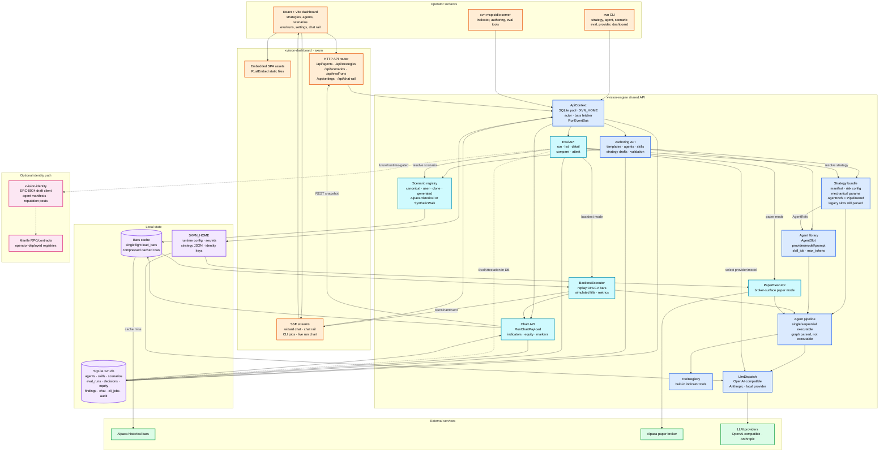

# XVISION — Architecture

> Multistrategy trading agent with on-chain reputation. Hackathon scope: prove that a population of strategies evaluated through a deterministic loom, with ERC-8004 reputation/validation receipts, produces a credibly auditable ranking of strategy variants.

---

## 1. Thesis

A multistrategy population evaluated through a deterministic loom, with
on-chain reputation and validation receipts via ERC-8004, produces a
credibly auditable ranking of trading strategy variants. The system is a
*marketplace* in shape — strategies have provenance, performance history,
and fork lineage as first-class on-chain artifacts.

The hackathon claim is narrower than the long-term thesis. We are not yet
claiming the loom can self-improve indefinitely (that's the deferred
Karpathy autoresearch direction). The hackathon claim is:

> On a fixed set of trading setups, a population of N strategies (classical
> TA + onchain + LLM-driven) evaluated through the loom produces an
> on-chain ranking that distinguishes strategies beyond noise on a
> pre-committed risk-adjusted return metric, with reputation and validation
> receipts visible on Mantle.

Everything in this document is in service of evaluating that claim cleanly.

---

## 2. System overview

A four-stage pipeline with two named LLM roles: **Intern** (Stage 1) and **Trader** (Stage 2). The Intern prepares neutral, balanced evidence — bull case, bear case, flat case, signal inventory, regime — but commits to no action. The Trader receives the briefing and produces the actual decision via a vanilla LLM call. The risk layer between the Trader and the Execution stage is deterministic code, no model in the loop.

```
                 ┌────────────────┐
   Setup ──────► │  Stage 1       │  Intern
                 │  Intern        │  • neutral evidence prep
                 │                │  • bull/bear/flat cases
                 └───────┬────────┘  • NO candidate decision
                         │ Briefing (JSON)
                         ▼
                 ┌────────────────┐
                 │  Stage 2       │  Trader (one Strategy variant
                 │  Trader        │  in the loom)
                 │                │  • LLM judgment on briefing
                 └───────┬────────┘
                         │ Decision JSON
                         ▼
                 ┌────────────────┐
                 │  Risk Layer    │  Deterministic veto
                 │  (rules code)  │  • position/loss/whitelist limits
                 └───────┬────────┘
                         │ Approved decision (or veto)
                         ▼
                 ┌────────────────┐
                 │  Stage 3       │  Execution
                 │  Execution     │  • Alpaca paper API / Orderly
                 │                │  • strict tool calls only
                 └────────────────┘
```

Why the split is structured this way: a previous draft had the Intern emit a candidate direction and size. That collapsed Stage 2 into a calibrator that simply rubber-stamped the Intern's anchor. Asking the Intern to hand off *evidence*, not *recommendations*, gives the Trader a real decision to make. Bull case / bear case / flat case is symmetric by construction. The Trader sees balanced inputs and produces a clean judgment that can be evaluated against other strategies in the loom on equal terms.

The Trader is wrapped as a `Strategy` adapter (`TraderArm`) so it competes against classical TA + onchain strategies on identical setups. Schema validation guarantees output shape; the risk layer guarantees safety.

### 2.1 Full system diagram

Renders inline on GitHub. Standalone source: `architecture-diagram.mermaid`. Blue is deterministic/runtime code; green is external services; purple is storage; orange is operator and API surfaces; pink is optional ERC-8004 identity wiring; cyan is eval and charting.



---

## 3. Stage 1 — Intern

**Purpose:** Produce a structured, neutral evidence briefing. The Intern researches; it does not recommend. The output is symmetric by construction so the Trader makes a clean judgment from balanced inputs.

**Model choice:** Backend-agnostic — picked at runtime via config (`provider`, `base_url`, `model`, `api_key_env`). Three backends behind one `InternBackend` trait:
- **OpenAI-compatible HTTP** (default for non-Anthropic models). One implementation covers OpenAI, OpenRouter, Together, Groq, DeepSeek, xAI, Mistral, plus any self-hosted server speaking the Chat Completions wire format — vLLM, Ollama (`/v1`), LM Studio, llama.cpp, TGI. Swap models or providers by editing config; no recompile.
- **Anthropic Messages API.** Used for Claude models (`claude-haiku-4-5` for speed, `claude-sonnet-4-6` for higher-quality analysis) and any Anthropic-API-compatible gateway. Called via `anthropic-sdk` or raw `reqwest`.
- **Local candle (optional, deferred).** Direct in-process inference via `candle` for fully air-gapped runs without an HTTP hop. Lower priority than the HTTP path because OpenAI-compat against a localhost vLLM/Ollama gives the same air-gap property with vastly more model coverage.

Reasoning models (o-series, DeepSeek-R1, Qwen-thinking, gpt-oss reasoning) are first-class — the backend strips provider-native reasoning fields and inline `<think>` blocks before JSON validation, and forwards `reasoning_effort` when supported.

**Input:** Market state object containing technical indicators (RSI, MAs, Bollinger, ATR, recent OHLCV), onchain signals (Nansen smart money flows, funding rate, exchange flows for the asset), and current portfolio state (open positions, unrealized P&L, available capital).

No news, no fundamentals (out of scope by user decision).

**Output (JSON):**

```json
{
  "cycle_id": "uuid",
  "asset": "BTC-PERP",
  "bull_case": "strongest argument for going long",
  "bear_case": "strongest argument for going short",
  "flat_case": "strongest argument for sitting this one out",
  "evidence_long": ["rsi_oversold", "smart_money_inflow", "funding_rate_neg"],
  "evidence_short": ["volume_declining", "lower_high_lower_low"],
  "evidence_flat": ["chop_in_5pct_range_3d", "low_signal_quality"],
  "regime": "trending | choppy | high_vol | low_vol",
  "signal_quality": 0.62,
  "horizon_hours": 4
}
```

The Intern's prompt explicitly instructs: *"Present balanced cases on all three sides. Do not recommend an action. Your job ends with the briefing — the Trader will decide."* No `candidate_direction` field, no `candidate_size_bps`. Those would commit the decision before the Trader gets to evaluate the evidence.

`signal_quality` is the analyst's estimate of *how clean the setup is* — a quality signal, not a directional signal. Strategies that read it can defer or downsize on noisy inputs.

`regime` is part of the briefing payload and is itself directionally neutral — knowing the market is "choppy" doesn't tell you which way it'll resolve.

This object is the contract between Intern and Trader. It is validated by `serde` + `garde` (Rust) before handoff — schema violations produce a typed error rather than a silently malformed briefing.

---

## 4. Stage 2 — Trader

**Purpose:** Make the final trading decision based on the Intern's neutral
evidence briefing. Stage 2 is one Strategy variant in the loom (LLM judgment
on balanced inputs); other strategies in the loom are classical TA, onchain
signal, or hybrid implementations.

**Naming:** "Trader" is the characterological role — the Intern researches
neutrally, the Trader decides. Both stages are LLM-backed; only the Trader
emits the final action.

**Model choice:** Backend-agnostic, picked at runtime via config. The
`TraderBackend` HTTP trait (see `crates/xvision-trader/src/backend.rs`)
abstracts over OpenAI-compatible endpoints — `OpenAiCompatBackend` is the
default impl, covering OpenAI, Anthropic, OpenRouter, vLLM, llama.cpp,
Ollama. Local `candle` inference is an optional path for fully air-gapped
runs. No model-side hooks or instrumentation; the Trader is a plain LLM
caller.

**Inference path:**
1. Receive Intern Briefing JSON.
2. Render briefing as a prompt requesting a structured decision. Prompt
   presents bull/bear/flat cases in parallel structure with no anchored
   recommendation.
3. Call the configured backend.
4. Parse output as JSON via `serde_json` with `garde` validation; on parse
   failure, retry once with a corrective system message before falling back
   to a parse-error path.

**Output (JSON):**

```json
{
  "cycle_id": "uuid",
  "action": "buy | sell | flat | close",
  "size_bps": 75,
  "direction": "long | short | flat",
  "stop_loss_pct": 2.5,
  "take_profit_pct": 5.0,
  "trader_summary": "string — one-line rationale"
}
```

The Trader is wrapped as a `Strategy` adapter (`TraderArm`) so it competes
in the loom against classical TA + onchain strategies on equal terms.

---

## 5. Risk Layer

**Purpose:** Deterministic safety net between Stage 2 and Stage 3. No LLM. Pure rule evaluation.

The risk layer either passes the decision through unchanged, modifies sizing downward, or vetoes the decision entirely. It never increases size or flips direction.

**Rules (initial set):**
- **Max position size:** No single position larger than 20% of portfolio NAV.
- **Max total exposure:** Sum of absolute position sizes ≤ 100% of NAV (no leverage in v1; perps come later).
- **Asset whitelist:** Only assets in `config/whitelist.yaml` are tradeable.
- **Daily loss circuit breaker:** If realized + unrealized loss for the day exceeds 5% of starting NAV, all new entries are vetoed until rollover.
- **Max open positions:** ≤ 5 concurrent positions.
- **Correlation cap:** No more than two positions in the same correlation cluster (BTC-cluster, ETH-cluster, SOL-cluster).
- **Stop loss required:** Every entry must specify a stop loss; reject decisions that omit it.

**Output:** `RiskDecision { approved: bool, original: Decision, modified: Decision | None, veto_reason: str | None }`

The risk layer logs every veto with reason. Vetoes are valuable signal — they tell us when a strategy pushes the agent into regions a human risk manager would also reject.

---

## 6. Stage 3 — Execution

**Purpose:** Translate approved decisions into Alpaca paper trading API calls. No model in the loop.

**Library:** `apca` (mature Alpaca client on crates.io; `alpaca-rs` is a 0.1.0 stub). Fall back to a thin `reqwest`-based wrapper if `apca` is missing endpoints we need — Alpaca's REST/WS surface is small.

**Operations supported:**
- Submit market order (entry).
- Submit bracket order (entry + stop + take-profit).
- Close position.
- Query portfolio state.

**Idempotency:** Each decision carries a `cycle_id` used as the broker `client_order_id` for entries, so duplicate retries collapse at the venue boundary.

**State sync:** Portfolio state is read from Alpaca after every action and cached for the next Stage 1 input.

**Execution paths in code:**
- **Backtest** is the default eval path. `BacktestExecutor` replays cached OHLCV bars, simulates fills, persists decisions/equity/metrics, and emits chart events for live dashboard streams.
- **Alpaca paper** is the configured broker-surface path for paper evals and manual smoke commands. It uses `AlpacaPaperSurface` / `AlpacaExecutor`, with `cycle_id` forwarded as `client_order_id`.
- **Orderly Network on Mantle** exists in `xvision-execution::OrderlyExecutor` for live perps experiments, but it is not the default `xvision-engine` eval broker surface. The broker-surface enum keeps `OrderlyLive` as a stub until the live path is wired into operator UX.

The shipped eval launcher selects `RunMode::Backtest` or `RunMode::Paper`; paper mode builds an Alpaca broker surface from Settings-stored credentials or `APCA_*` environment variables.

> **Venue history (2026-05-03).** Three iterations in one day:
> 1. Earliest drafts named "Byreal Perps on Mantle" — wrong on its face: Byreal CLMM is Solana, Byreal Perps CLI is Hyperliquid, the "Byreal-on-Mantle" association is a Mantle Super Portal bridge into Byreal's *Solana* liquidity.
> 2. Pivoted to Vertex Protocol; M0 found Vertex operationally dead (all gateways 404, repos ~1 year stale).
> 3. Fell back to Byreal Perps CLI on Hyperliquid (M0 passed, committed at `1703b71`); then discovered Orderly via FusionX's `fusionx_pro` broker_id. M0' for Orderly also passed, and Orderly's Mantle-native + Rust-native integration shape strictly dominates the cross-chain Byreal CLI path.
>
> The hackathon Path 1 ("DeFi Deep Dive") names *Byreal Agent Skills / Byreal Perps CLI / RealClaw* as winning tooling. v1 keeps **Byreal Agent Skills** vendored as the Stage 1 Intern's skill catalog (M4) so the Path 1 endorsement is satisfied via context, not execution. The Byreal Perps CLI path is preserved as a verified fork option — see `decisions/0006-executor-choice.md` and `probes/m0-byreal/`. Earlier-considered Mantle perps alternates (KTX.Finance — DNS gone; TsunamiX — app/docs NXDOMAIN; IntentX — alive but Base-leaning) are off the table until Mantle's perps ecosystem matures.

---

### 6.1 ERC-8004 — On-chain agent identity and strategy provenance

ERC-8004 identity support is optional in the current codebase. The `xvision-identity` crate is excluded from default workspace builds, ships draft Identity/Reputation registry bindings, and is intentionally not required for the dashboard, CLI, or eval pipeline to run.

**Identity Registry (ERC-721 agent NFT).** The planned mint flow registers an `agentURI` manifest for a strategy or agent identity. The current `xvision-identity` crate can construct manifests and client calls, but production deployment and operator wiring remain gated by ADR 0008.

**Reputation Registry.** The crate models reputation feedback as signed outcome posts keyed by agent token id. Current eval attestations are persisted locally in SQLite; posting reputation on-chain is a follow-on integration, not part of the default eval run.

**Validation Registry.** The architecture still reserves a place for per-trade validation proofs, but the current implementation has local `EvalAttestation` signing and persistence. On-chain validation registry submission is not wired into default Stage 3 execution.

```json
{
  "cycle_id": "uuid",
  "action": "buy | sell | flat | close",
  "agent_id": 42,
  "strategy_name": "mean_reversion_v1",
  "trade_result_hash": "keccak256(closed_pnl | timestamp | price)",
  "run_id": "uuid"
}
```

`agent_id` is the eventual agent NFT token id; `strategy_name` is the readable label preserved off-chain. The local audit trail already records the causal chain; the on-chain path is the future public verification layer.

**Why this matters for the thesis.** Most on-chain agent identity is retrospective: address + transaction history. The Validation proof is prospective — the strategy is committed at inference time, identified by its NFT token, and recorded before the outcome is known. The trade is the *output* of the strategy, not the definition of it. The on-chain record proves the causal chain: this strategy variant → this decision → this outcome.

**On-chain footprint summary:**

| Artifact | Size | Location | When |
|---|---|---|---|
| Strategy manifest (JSON sidecar) | ~500 bytes | IPFS / Arweave | Once per strategy mint / fork |
| `strategy_manifest_cid` in agent NFT metadata | 32–64 bytes | Mantle (Identity Registry) | Once at strategy mint |
| `agent_id` + receipt fields per trade | ~32 bytes | Mantle (Validation Registry) | After every closed position |
| Reputation entry per experiment run | ~64 bytes | Mantle (Reputation Registry) | After each backtest / paper run |

The on-chain artifacts are hashes, commitments, and the tiny per-trade strategy reference. EVM storage at 20K gas per 32-byte slot keeps the loom's per-trade and per-run costs bounded even on Mantle.

**Implementation status.** `xvision-identity` provides draft `alloy` clients and manifest types, but no other workspace crate depends on it by default. Build it explicitly with `cargo build -p xvision-identity`; see ADR 0008 before treating registry addresses or ABIs as production inputs.

---

## 8. Data pipeline

**Sources:**
- **Price/OHLCV:** Alpaca data API (free with paper account).
- **Technicals:** Computed locally via `pandas-ta` from OHLCV.
- **Onchain / smart money:** Nansen API ($49/month plan).
- **Funding rates / open interest:** Direct from exchange APIs (Binance, Bybit) — public endpoints, no auth needed.

**Cadence:** Pull every 15 minutes during active sessions for v1. Higher-frequency loops are post-hackathon.

**Caching:** All raw data is logged to local SQLite for reproducibility of backtests. Stage 1 and Stage 2 inputs/outputs are persisted with timestamps so any decision can be replayed.

---

## 9. Eval framework

The eval framework is the most important non-obvious piece of this project. Without it, strategy comparisons cannot be measured and the Karpathy autoresearch loop has nothing to learn from.

### 9.1 Backtest harness

Replays historical setups through the full Stage 1 → Stage 2 → Risk → Stage 3 pipeline against historical price data. Stage 3 in backtest mode hits a simulated execution engine instead of Alpaca. Slippage and fee assumptions are configurable.

**Why this matters more than forward paper trading:** 500 backtested setups in an evening yields more statistical signal than 500 forward paper trades over weeks. Per-trade noise is brutal; you need population statistics to evaluate strategy variants.

### 9.2 Metrics — pre-committed

These are the metrics the hackathon demo will report. Picked now, before any results are run, so we can't backfit:

**Primary metric (the headline number):**
> **Sharpe ratio delta (Δ-Sharpe):** annualized Sharpe of Strategy A minus annualized Sharpe of Strategy B, evaluated on the same set of setups, paired.

This isolates the contribution of one strategy variant against another. It is the single number the demo lives or dies on.

**Secondary metrics (the dashboard):**
- **Max drawdown** (peak-to-trough loss, %): Risk profile. Must not be catastrophic for either strategy.
- **Profit factor** (gross wins / gross losses): Intuitive, demo-friendly.
- **Win rate** (% of trades profitable): Caveat that high win rate with bad profit factor is a warning sign.
- **Decision divergence rate** (% of setups where Strategy A and Strategy B produced different actions): Confirms that strategies are actually behaving differently, not just nudging within the same decision.

**Statistical significance:**
- Minimum 30 paired trades for any signal interpretation.
- Target 100+ paired trades for hackathon demo.
- Report 95% confidence interval on Δ-Sharpe via paired bootstrap (10k resamples).

**Anti-overfitting gate (hard requirement):**
No strategy variant advances to paper trading unless it shows positive Δ-Sharpe vs a pre-committed baseline in at least one pre-2023 bear regime *and* at least one 2023–2024 bull regime. A strategy that only beats the baseline in trending markets is not evidence — it is a backtest artefact. This gate is explicit and checked programmatically before any paper-trading run is authorized. Single-regime wins, however large, are capped: a result that does not span at least two distinct regime types cannot be reported as a positive finding. Rationale: NexusTrade's $676 hill-climbing experiment showed exactly this failure mode — a rubric that rewarded peak-year returns drove the agent from a 71/100 Iron Condor (survived 2022 bear, 54% avg) to a 27/100 directional disaster (-6.3% avg, 92% drawdown) by Round 5, following evaluator feedback faithfully into a single-regime optimum.

### 9.3 Baselines

Beyond pairwise Strategy A vs Strategy B comparisons, every strategy variant must beat external baselines to demonstrate edge.

**Null baselines (must beat):**
- Buy-and-hold the asset basket from t=0.
- Random direction, constant 1% sizing, same trade frequency.
- Always-long, always-short.

**Classical technical baselines:**
- RSI 14 with 30/70 thresholds, mean-reversion entries.
- MA crossover 30/90 (golden/death cross).
- MA triple-confirmation 30/60/90 (all three must align).
- Bollinger Bands 20/2 mean-reversion at the bands.
- MACD 12/26/9 momentum.
- Donchian 20-day breakout (Turtle baseline — surprisingly tough).
- Fibonacci retracements at 38.2/50/61.8 with swing detection via rolling-window peak finder.

**Onchain baselines (the real bar):**
- Nansen smart-money copy-trading: follow whale flows directly, no model.
- Funding rate fader: at funding-rate extremes, fade the crowd.
- Stablecoin exchange-inflow: large USDT/USDC moves to exchanges → reduce risk.
- Liquidation cascade fader: after large liquidation events, mean-revert.

**ML baseline (stretch):**
- XGBoost on technical + onchain features. Often surprisingly hard to beat.

### 9.4 Structured traces (flight recorder)

Every Stage 1 and Stage 2 call produces a structured trace record persisted to SQLite alongside the briefing and decision. Without traces, a strategy that underperforms in backtest is a black box; with traces, the exact iteration where behaviour diverged is pinpointable.

**Minimum trace fields per call:**
- `run_id`, `cycle_id`, `stage` (intern | trader), `arm_name` (strategy label)
- `model` and backend identifier
- Full input (system prompt + user content)
- Raw model output (full JSON string, pre-parse)
- Parse success / validation errors
- Token count (prompt + completion) and latency (ms)
- Any exception with traceback

**Storage:** trace-like data is represented today across eval decisions, equity samples, findings, audit rows, and stage-specific persisted JSON. A dedicated `traces` table remains a clean target if the eval loop needs full prompt/output replay keyed on `(run_id, cycle_id, stage)`.

**Why this matters:** Traces must exist before any evaluation loop runs. An eval loop without traces cannot distinguish "the strategy was wrong" from "the prompt was wrong" from "the model produced a parse error and fell back." Traces are the diagnostic layer that makes every other eval result interpretable.

### 9.5 Forward paper trading

Forward Alpaca paper trading runs continuously after the backtest establishes baseline. It is deployment validation, not primary eval. The loom runs multiple strategies in parallel (alternating setups across instances) so live paper trading produces paired data.

---

## 10. Tech stack

The runtime is Rust. Plotting and a small offline analysis surface use Python via notebooks; nothing in the production binary depends on Python.

**Runtime (Rust):**
- Rust stable (current MSRV pinned in `rust-toolchain.toml`)
- Cargo workspace with one crate per architectural concern (see §10.1)
- macOS Apple Silicon (Metal) primary; Linux/CUDA for cloud runs

**Inference:**
- `reqwest` — primary backend for both Intern (Stage 1) and Trader (Stage 2). Covers OpenAI- and Anthropic-compatible HTTP endpoints uniformly (vLLM, llama.cpp, Ollama, OpenRouter, Anthropic, OpenAI). `anthropic-sdk` and `async-openai` are optional ergonomic wrappers.
- `candle` — HuggingFace's Rust ML framework, supports Qwen-3 with Q4/Q5 quantization, Metal and CUDA backends. Optional local-inference path for the Trader (air-gapped runs).
- `llama-cpp-rs` — fallback option if candle quantization quality is insufficient on a given platform.

**Trading:**
- `apca` for Stage 3 Alpaca paper (`alpaca-rs` on crates.io is a stub)
- Direct `reqwest` Orderly REST integration in `xvision-execution::orderly` for live Mantle experiments. The default engine eval path still uses backtest or Alpaca paper broker surfaces.
- `alloy` inside optional `xvision-identity` for draft ERC-8004 identity/reputation clients.
- `ta` crate (or hand-rolled in `polars`) for technical indicators
- Custom thin clients for Nansen and exchange APIs via `reqwest`

**Data/eval:**
- `sqlx` (compile-time-checked queries) on SQLite for persistence
- `polars` for tabular data manipulation (faster and more ergonomic than pandas at our scale)
- `ndarray` for numerical work where polars isn't the right shape
- Eval results emit structured JSON; plotting via a small Python notebook (`notebooks/eval_plots.py`) consuming those JSONs — pragmatic concession, plotting is the one place Python remains genuinely better

**App layer:**
- `serde` + `garde` (or `validator`) for typed schema enforcement on stage handoffs — contract violations become compile errors where possible, runtime errors elsewhere
- `clap` for CLI
- `tracing` for structured logging (also drives observability — see telemetry block)
- `teloxide` for the Telegram demo bot

**Tracing & observability:**
- `tracing` + `tracing-subscriber` for structured spans
- `tracing-opentelemetry` + `opentelemetry-otlp` for OTLP export
- Self-hosted Langfuse as primary backend (Docker compose: Postgres + Clickhouse)
- OpenTelemetry GenAI semantic conventions throughout
- Dual-write: SQLite (§9.4 flight recorder) for replay; OTel for live observability

**Dev:**
- `cargo test` + `proptest` for unit and property-based tests
- `criterion` for benchmarks (gating hot path, especially)
- `clippy` for lint
- `cargo fmt` for formatting
- `cargo deny` for license/CVE auditing
- `pre-commit` hooks calling `cargo fmt --check`, `cargo clippy --all-targets`, `cargo test`

**Secrets:** `op` (1Password CLI) per workspace convention. Never hardcode keys.

### 10.1 Cargo workspace layout

```
xvision/
├── Cargo.toml                    # workspace root
├── rust-toolchain.toml
│
├── crates/
│   ├── xvision-core/             # types, schemas, config, SQLite persistence, manifest types
│   ├── xvision-data/             # OHLCV ingest, indicators, onchain signals
│   ├── xvision-intern/           # Stage 1 (OpenAI- or Anthropic-compatible HTTP)
│   ├── xvision-trader/           # Stage 2 (TraderBackend HTTP trait, optional local candle)
│   ├── xvision-risk/             # deterministic risk layer
│   ├── xvision-execution/        # Broker/executor surfaces: Alpaca + Orderly
│   ├── xvision-engine/           # Shared API: agents, strategies, scenarios, eval, charts
│   ├── xvision-dashboard/        # Axum API + embedded Vite SPA
│   ├── xvision-identity/         # Optional ERC-8004 manifest + reputation client
│   ├── xvision-eval/             # Legacy backtest harness, baselines, Δ-Sharpe
│   ├── xvision-harness/          # boundary probes (minimal v1 corpus)
│   └── xvision-cli/              # clap-based CLI; installed binary is `xvn`
│
├── config/                       # TOML configs (whitelist, risk)
├── data/
│   └── probes/                   # boundary probe corpus (minimal v1, versioned)
├── notebooks/                    # eval plotting (Python, offline)
└── docs/
```

The workspace structure makes the contract layer load-bearing: each crate's public API is a typed surface, and cross-crate calls fail to compile if the contract doesn't match. A `xvision-data` function cannot reach into `xvision-eval`'s internals.

---

## 11. Out of scope (deferred)

Explicit non-goals for hackathon. Each is a real follow-on but not v1:

- Karpathy autoresearch loop (LLM-proposed strategy mutations from per-strategy trade ledgers)
- **Capital bridge** (`@mantleio/sdk` ETH↔Mantle): explicitly out of scope. Funds are pre-positioned on Mantle by the user; the agent only ever sees on-Mantle balances and never executes a bridge transaction itself.
- Options Greeks, derivatives strategy
- Multi-model evaluation tournament
- **Cross-run memory system (MemPalace):** Deferred — strategy ledgers are the v1 substitute for cross-run learning.
- Multi-asset basket — v1 is BTC only
- xStocks / Mantle tokenized equities
- Telegram demo bot
- `mantle-risk-evaluator` LLM pre-flight gate
- Telegram interactive command set beyond demo-supporting commands
- News, fundamentals, sentiment from social
- Auto-scaling / cloud deployment beyond a single Vast.ai/RunPod box for backtest acceleration

**Current cut:** ERC-8004 and Orderly remain important architecture tracks, but they are not required for the shipped dashboard/eval loop. Default operator flow is strategy/agent authoring → scenario-backed backtest or Alpaca paper eval → local run storage and optional local eval attestation.

---

## 12. Open architectural questions resolved

For the record, the following were debated and decided:

| Question | Resolution |
|---|---|
| CV substrate location? | **Moved to xvision-play** per ADR 0011. xvision is multistrategy + marketplace; CV research continues in xvision-play with the full development trail preserved. |
| Stage 2 as decider vs calibrator? | **Decider.** Risk layer compensates for safety; the Trader emits the action. |
| Stage 2 name? | **Trader** (paired with Stage 1 = **Intern**). Characterological roles: Intern researches neutrally, Trader decides. |
| Does Intern recommend a candidate decision? | **No.** Intern emits balanced bull/bear/flat cases with parallel evidence inventories. Recommending would prompt-anchor the Trader. |
| Where does risk live? | **Between Stage 2 and Stage 3** as deterministic rule code. |
| Primary eval metric? | **Δ-Sharpe** between Strategy A and Strategy B, paired on the same setups. |
| Backtest or forward paper? | **Backtest first** for population statistics; forward paper for deployment validation. |
| Telemetry backend (v2)? | **Self-hosted Langfuse** as primary, OpenTelemetry GenAI conventions throughout. **v1 ships SQLite flight recorder + `tracing` console only**; full OTel/Langfuse deferred to v2. |
| On-chain executor? | **Orderly Network on Mantle** remains the accepted live-perps direction in ADR 0006, and `xvision-execution::OrderlyExecutor` exists. The default eval/operator loop is currently backtest or Alpaca paper; Orderly broker-surface UX and ERC-8004 posting stay follow-on wiring. |
| Anti-overfit gate? | **Reportable, not blocking, in v1.** v1 surfaces a named verdict (PassesBothRegimes / SingleRegimeEvidence / Fails) in the report. The gate re-tightens to blocking when any automated optimizer over strategies ships (Karpathy autoresearch v2). |

---

## 13. References

**Inference & ML (Rust):**
- candle (HuggingFace Rust ML framework). https://github.com/huggingface/candle
- llama-cpp-rs (fallback). https://github.com/utilityai/llama-cpp-rs
- mistralrs (candle-based serving). https://github.com/EricLBuehler/mistral.rs

**Trading & onchain (Rust):**
- apca. https://github.com/d-e-s-o/apca
- alloy (modern Ethereum stack). https://github.com/alloy-rs/alloy
- ta (technical analysis). https://crates.io/crates/ta

**ERC-8004 — on-chain agent identity:**
- ERC-8004: Trustless Agents (EIP). https://eips.ethereum.org/EIPS/eip-8004
- Mantle ERC-8004 mainnet deployment. https://chainwire.org/2026/02/16/mantle-unlocks-autonomous-economy-with-erc-8004-deployment/
- ERC-8004 Identity and Reputation for AI Agents (Allium). https://www.allium.so/blog/onchain-ai-identity-what-erc-8004-unlocks-for-agent-infrastructure/
- ERC-8004 Developer Guide (QuickNode). https://blog.quicknode.com/erc-8004-a-developers-guide-to-trustless-ai-agent-identity/

**Observability & tracing:**
- OpenTelemetry GenAI semantic conventions. https://opentelemetry.io/docs/specs/semconv/gen-ai/
- Langfuse (self-hosted LLM observability). https://github.com/langfuse/langfuse
- Phoenix (Arize). https://github.com/Arize-ai/phoenix
- Pydantic Logfire (fallback via OTLP). https://logfire.pydantic.dev/
- Rust `tracing` crate. https://docs.rs/tracing/latest/tracing/
- `tracing-opentelemetry`. https://docs.rs/tracing-opentelemetry/

**Rust substrate:**
- `tokio`. https://tokio.rs/
- `arc-swap` (snapshot semantics). https://docs.rs/arc-swap/
- `serde` + `garde` (typed schemas with validation). https://serde.rs/ · https://github.com/jprochazk/garde
- `polars` (tabular data). https://pola.rs/
- `sqlx` (compile-time-checked queries). https://github.com/launchbadge/sqlx

---

*Document version: 2026-05-07 (post-ADR-0011 slim-down). Lives at `/Users/edkennedy/Code/xvision/architecture.md`.*
