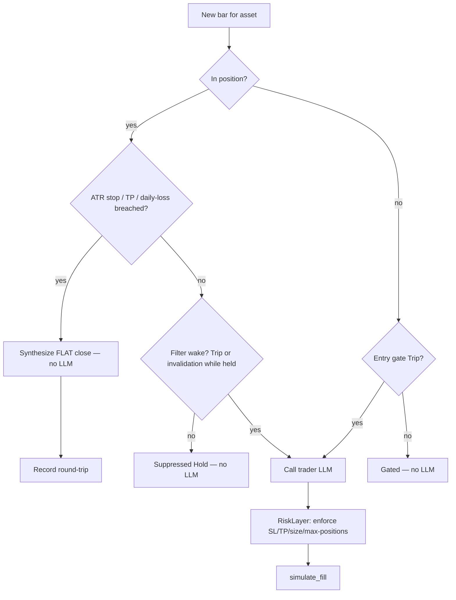

# fix: Eval harness — protective exits, exit-wake observability, run accounting

## Summary

A DeepSeek V4 Pro eval run (`01KT65CS4QKMJ3GBRCB378SDQP`, BTC/USD 1h, `crypto-bull-q1-2025`) opened one long and **held it through a −14.5% adverse move without ever stopping out**, because the eval backtest executor enforces none of the strategy's protective risk controls and the in-position trader is never woken on an exit signal. PR #787 fixed the *cost* of in-position waking (default `Always → OnInvalidationOrTargetOnly`) but the new policy is misimplemented — it suppresses the very invalidation wake it promises. This plan makes eval backtests honor protective exits, lets the trader actually see exit signals, and makes run activity auditable.

This is **harness-only** work. Prompt/strategy-design improvements and the multi-asset contamination bug (issue #785) are explicitly out of scope.

---

## Problem Frame

The eval backtest executor (`crates/xvision-engine/src/eval/executor/backtest.rs`) **bypasses the `xvision-risk` `RiskLayer` entirely**. It reads only `strategy.risk.risk_pct_per_trade` (for sizing); `stop_loss_atr_multiple`, `daily_loss_kill_pct`, `max_concurrent_positions`, and `max_position_pct_nav` are defined on `RiskConfig` but never enforced in this path. Consequences observed in-run:

1. **No protective exits.** A position rode −14.5% with no stop-out; `risk.stop_loss_atr_multiple = 2.0` was inert. The eval `TraderOutput` schema also has no `stop_loss`/`take_profit` fields, so the model's prose brackets (present in 70/430 decisions) are discarded — and the model wrongly believes it is protected.
2. **Exit signal is unobservable.** The filter only wakes the trader on the entry gate; the prompted exit (EMA12 < EMA26) appeared in **0 of 430** decisions. PR #787's `OnInvalidationOrTargetOnly` suppresses both Trip and Hold while in-position (identical to `Never` at the suppression gate), so it never wakes on invalidation.
3. **Run accounting is incoherent.** `wakeups=41` vs `n_decisions=430` vs `suppressed_in_position=0` don't reconcile; `n_trades` counts legs not round-trips; `win_rate` is hardcoded `0.0`.

---

## Requirements

- **R1** — In eval backtest mode, a held position is force-closed when `strategy.risk.stop_loss_atr_multiple` is breached (ATR-based stop from entry), without requiring an LLM call.
- **R2** — The eval `TraderOutput` schema carries optional `stop_loss_pct` / `take_profit_pct`, they are validated, and honored on the simulated fill (model-set brackets enforced; deterministic ATR stop as fallback when absent).
- **R3** — `daily_loss_kill_pct` and `max_concurrent_positions` are enforced in the eval backtest path.
- **R4** — While in-position, the trader is woken on filter **invalidation** (gate true→false) and on a fresh Trip, but NOT on sustained-true Hold bars — i.e. `OnInvalidationOrTargetOnly` does what its name says.
- **R5** — `n_trades` counts closed round-trips, `win_rate` reflects realized round-trip PnL, and `wakeups` / `n_decisions` / `suppressed_in_position` reconcile and are documented.
- **R6** — Existing eval runs/tests continue to pass; behavior changes are covered by regression tests that fail on the current code.

Traceability: R1–R3 ⇒ QA finding "protective exits not enforced"; R4 ⇒ "exit signal unobservable" (+ PR #787 follow-up); R5 ⇒ "wake/decision accounting incoherent".

---

## Key Technical Decisions

### KTD1 — Reuse `xvision-risk::RiskLayer` vs. re-implement stops inline
The legacy `xvision-trader` path already enforces `StopLossPresent`, `TakeProfitRR`, `DailyLossCircuit`, `MaxPositionSize`, `MaxOpenPositions` via `RiskLayer::evaluate_with_conviction()` (`crates/xvision-risk/src/lib.rs:104-165`) against `TraderDecision` (`crates/xvision-core/src/trading.rs:196-217`, which already has `stop_loss_pct`/`take_profit_pct`).

**Decision (recommended): wire the eval path through `RiskLayer` at the apply seam** rather than re-implementing ATR/daily-loss checks inline. Single source of truth, kills the parallel-divergence risk, and immediately satisfies R1–R3. Cost: the eval executor must map `TraderOutput` → the risk layer's expected decision shape and import `xvision-risk`. *Alternative considered:* inline ATR-stop + daily-loss + max-positions checks in `backtest.rs` using `strategy.risk` fields only — lower coupling, faster to land, but re-implements logic that already exists and will drift. Inline is acceptable as a fallback **only** if importing `xvision-risk` into the eval executor creates a dependency cycle (verify during U2).

### KTD2 — ATR stop is deterministic and pre-LLM
The stop check must run at the **top of each per-bar/per-asset iteration before the LLM pipeline** (and the broker/fill seam at `backtest.rs:1737`), synthesizing a `flat` action and skipping the model call when breached. This makes exits cost-free and independent of waking the model.

### KTD3 — Fix `OnInvalidationOrTargetOnly` by reordering transition vs. suppression
Today the suppression gate (`runtime.rs:241-258`) fires before the Trip/Hold transition is computed (`runtime.rs:272-278`). **Compute the transition first, then suppress only `Hold` while in-position** for `OnInvalidationOrTargetOnly`; let Trip (and gate-invalidation) through. `Never` keeps suppressing everything. This is the minimal correct fix and preserves PR #787's cost win (Hold bars still suppressed).

### KTD4 — First-class exit conditions: defer
A separate `exit_conditions` tree on `Filter` (`types.rs:966-989`) would let strategies express exits independent of the entry gate. **Defer** — R4's invalidation-wake fix plus R1's deterministic stop covers the observed failure without a schema/migration change. Record as follow-up.

### KTD5 — Round-trip accounting
Pair opens/closes into round-trips at fill time to derive `n_trades` (closed round-trips) and a real `win_rate`; keep a separate leg counter if needed for observability. Document what each `filter_summary` counter measures so `wakeups`/`n_decisions` reconcile (gated slots don't increment `decision_idx`; that is correct but undocumented).

---

## High-Level Technical Design

Per-asset, per-bar decision flow after this change (deterministic gates run before any LLM call):

---

## Implementation Units

### U1. Add `stop_loss_pct` / `take_profit_pct` to the eval `TraderOutput` schema
- **Goal:** let the eval trader emit enforceable protective brackets (R2).
- **Files:** `crates/xvision-engine/src/eval/executor/trader_output.rs` (struct at 7-13, `validate()` at 391); test `crates/xvision-engine/tests/` (new `eval_trader_output_brackets.rs` or extend an existing trader-output test).
- **Approach:** add `stop_loss_pct: Option<f32>` and `take_profit_pct: Option<f32>` (keep `#[serde(deny_unknown_fields)]`; optional so existing outputs still parse). Validate ranges mirroring `TraderDecision` (SL 0.1–20.0, TP 0.1–50.0) when present. Thread the parsed values to the fill/risk seam (consumed in U2).
- **Dependencies:** none.
- **Test scenarios:**
  - Happy: output with valid SL/TP parses and validates; values surfaced to the executor.
  - Edge: SL/TP absent → parses, `None`, no error (back-compat).
  - Error: out-of-range SL (e.g. 0) or TP rejected with a clear validation error.
  - Error: unknown bracket field still rejected (`deny_unknown_fields` intact).
- **Verification:** new fields round-trip through serde; validation rejects bad ranges; existing trader-output tests green.

### U2. Enforce protective exits at the backtest apply seam
- **Goal:** force-close on ATR stop / take-profit / daily-loss, cap concurrent positions, honor model brackets (R1, R2, R3).
- **Files:** `crates/xvision-engine/src/eval/executor/backtest.rs` (per-bar loop; apply seam 1737-1741; sizing reads at 1458/1708); likely new import of `crates/xvision-risk` (per KTD1); `crates/xvision-engine/src/strategies/risk.rs` (RiskConfig fields).
- **Approach:** before the LLM pipeline for an in-position asset, compute the ATR(14) stop distance and check `bar.low`/`bar.high` against entry ± `stop_loss_atr_multiple × ATR` (and model `stop_loss_pct`/`take_profit_pct` from U1 when present). On breach, synthesize a `flat` close, apply via the existing fill path, skip the model. Add a daily-loss kill check against `daily_loss_kill_pct` and a `max_concurrent_positions` veto on new opens. Prefer routing the post-LLM decision through `RiskLayer::evaluate_with_conviction()` (KTD1) — map `TraderOutput` → the risk layer's decision shape; fall back to inline checks only if a dep cycle blocks the import.
- **Dependencies:** U1 (bracket fields).
- **Execution note:** start with a failing characterization test that holds a position through a >stop adverse move and asserts a forced close.
- **Test scenarios:**
  - Covers R1: position held into a −X% move where X > `stop_loss_atr_multiple × ATR` → forced `flat` close on the breaching bar, realized loss recorded, no LLM call for that bar. (Fails on current code — position never closes.)
  - Covers R2: model emits `take_profit_pct`; price reaches it → position closed at/above TP.
  - Covers R3: cumulative realized loss exceeds `daily_loss_kill_pct` → further opens vetoed for the rest of that day.
  - Covers R3: `max_concurrent_positions = 2` with 3 eligible assets → only 2 opens admitted.
  - Edge: no ATR available (warmup) → no spurious stop; open deferred or stop skipped with a logged reason.
  - Pattern to follow: `crates/xvision-engine/tests/eval_broker_circuit_breaker.rs`, `eval_guardrails.rs`, `crates/xvision-risk/tests/risk_sees_conviction.rs`.
- **Verification:** the −14.5% repro scenario now closes via stop; guardrail tests green.

### U3. Make `OnInvalidationOrTargetOnly` wake on invalidation (not suppress it)
- **Goal:** the in-position trader is woken on gate invalidation + fresh Trip, but not on Hold (R4), preserving PR #787's cost win.
- **Files:** `crates/xvision-filters/src/runtime.rs` (suppression gate 241-258, transition compute 272-278); inline tests in same file; `crates/xvision-engine/tests/eval_filter_hook.rs`.
- **Approach:** reorder so the Trip/Hold/invalidation transition is computed before the in-position suppression decision. For `OnInvalidationOrTargetOnly`: suppress only sustained-true `Hold` while in-position; allow Trip and gate true→false invalidation to wake. `Never` unchanged (suppress all in-position). Keep `Always` opt-in (wake every active bar).
- **Dependencies:** none (independent of U1/U2).
- **Test scenarios:**
  - Covers R4: holding across sustained-true bars → Hold suppressed (`suppressed_in_position` increments), 0 extra LLM calls.
  - Covers R4: gate goes true→false while holding → a wake is emitted (NOT suppressed). (Fails on current code.)
  - Covers R4: fresh Trip while holding → wake emitted.
  - Out-of-position: every active bar still wakes (regression guard from PR #787).
  - Pattern to follow: existing `suppressed_in_position_when_never` test and PR #787's `holding_a_position_does_not_wake_trader_every_bar`.
- **Verification:** invalidation produces a wake; Hold does not; PR #787 cost tests still pass.

### U4. Reconcile and document run accounting
- **Goal:** `n_trades` = closed round-trips, real `win_rate`, reconciled/ documented counters (R5).
- **Files:** `crates/xvision-engine/src/eval/executor/backtest.rs` (n_trades 1739-1741, win_rate/n_decisions 2039-2041, decision_idx 1111/1967, gated skip 928-934); `crates/xvision-filters/src/events.rs` (`FilterSummary::from_events` 125-187); tests `crates/xvision-engine/tests/eval_metrics.rs`, `decisions_count.rs`.
- **Approach:** pair opens→closes into round-trips at the fill seam; derive `n_trades` (closed round-trips) and `win_rate` from realized round-trip PnL (replace the hardcoded `0.0` at 2039). Add a doc comment defining each counter (gated slots intentionally don't increment `decision_idx`; `wakeups` counts Trips; `suppressed_in_position` counts Hold suppressions) and, if cheap, assert reconciliation in a test.
- **Dependencies:** benefits from U2 (closes now occur) but can land independently with synthetic closes in tests.
- **Test scenarios:**
  - Covers R5: open + later close → `n_trades == 1` (round-trip), not 2.
  - Covers R5: winning vs losing round-trip → `win_rate` reflects realized PnL sign.
  - Covers R5: a run with N Trips and M Hold-suppressions → `wakeups == N`, `suppressed_in_position == M`, and `n_decisions` equals LLM-pipeline slots.
  - Pattern to follow: `eval_metrics.rs`, `eval_observability.rs`.
- **Verification:** metrics tests assert round-trip semantics; counters reconcile.

---

## Risks & Dependencies

- **No Rust toolchain on the current host** (and full xvision builds OOM small boxes — see GHCR deploy memory). Local `cargo build`/`cargo test` is not possible here; **CI must build and run the new tests**. Flag prominently on the PR.
- **Coordinate with PR #787** — U3 edits the same `runtime.rs` suppression logic; rebase on #787 (don't reintroduce `Always` as default).
- **KTD1 dependency cycle risk** — importing `xvision-risk` into `xvision-engine`'s eval executor may not be cycle-free; U2 must verify before committing to the reuse path, else fall back to inline checks.
- **Behavior change visibility** — enforced stops will change historical eval PnL/Sharpe for existing strategies; this is intended (results were previously unprotected) but should be called out so dashboards aren't misread as regressions.

---

## Scope Boundaries

### In scope
- Deterministic protective-exit enforcement in the eval backtest path (R1–R3).
- Eval `TraderOutput` SL/TP fields + enforcement (R2).
- `OnInvalidationOrTargetOnly` invalidation-wake fix (R4).
- Run accounting reconciliation (R5).

### Deferred to follow-up work
- First-class `exit_conditions` tree on `Filter` (KTD4) — a larger filter-schema change; revisit if invalidation-wake + deterministic stops prove insufficient.
- Trailing stops / time-based exits.

### Out of scope (not this plan)
- Multi-asset price/indicator contamination — issue #785.
- Prompt and strategy-design changes (exit rules, sizing, regime re-labeling).
- Rebuilding/redeploying the dashboard image.

---

## Sources & Research
- Origin findings: `docs/QA/2026-06-03-deepseek-v4-multiasset-1h-eval-findings.md`.
- Run evidence: `xvn eval export 01KT65CS4QKMJ3GBRCB378SDQP` (429 holds, 1 open, 0 closes; −14.5% adverse excursion; `risk.stop_loss_atr_multiple=2.0` inert).
- Code grounding (file:line) per the Implementation Units; legacy enforcement to mirror in `crates/xvision-risk/src/lib.rs:104-165` and `crates/xvision-core/src/trading.rs:196-217`.
- Builds on PR #787 (in-position wake cost trap).
