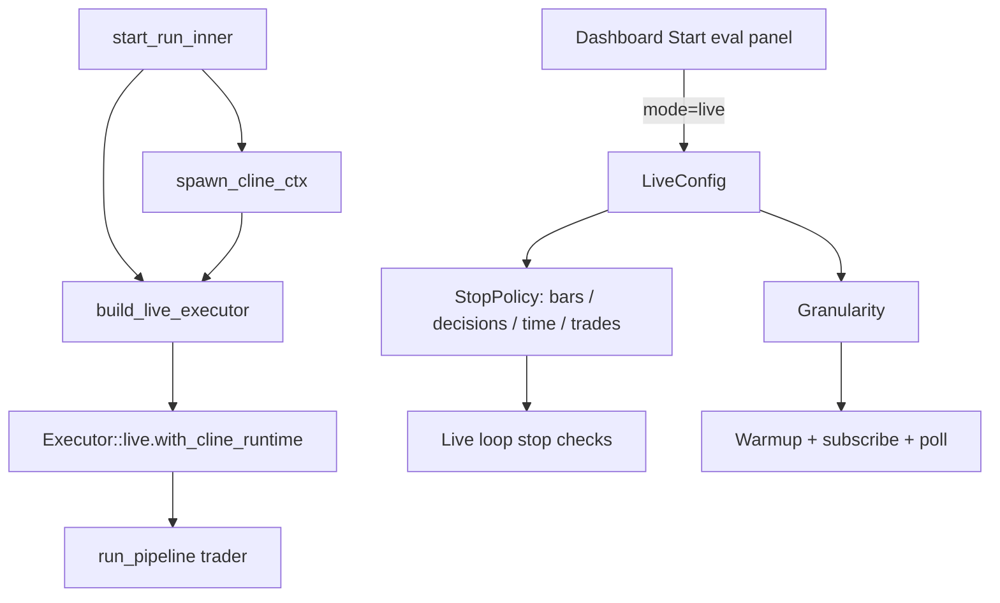

# fix: Repair forward test launch and controls

## Summary

Forward test launch currently spawns a Cline sidecar but fails to thread it into the live executor, so the trader pipeline reaches WU-6's hard error path. This plan fixes that wiring and narrows the dashboard launcher to the requested Alpaca-paper forward-test surface with optional duration limits.

---

## Problem Frame

The operator can select forward testing, but the first live trading decision fails with `trader requires the Cline sidecar` because the live executor is built without the `ClineDispatchCtx` created by `spawn_cline_ctx`. The same launcher also exposes unsupported or unwanted choices: scenario selection remains visible for forward tests, Byreal/Orderly/Degen venues are selectable, bars are required, and the duration model does not express the requested first-limit-wins behavior.

---

## Requirements

**Launch reliability**

- R1. Forward test evals must enter the live trader pipeline with the spawned Cline sidecar context instead of falling through to the retired `LlmDispatch` path.
- R2. The sidecar spawn failure must remain a synchronous launch error when `XVN_AGENTD_BIN` or provider setup is missing; do not reintroduce a silent fallback.

**Forward-test API semantics**

- R3. `LiveConfig` must support optional bar, decision, wall-clock, and completed-trade duration limits, with validation rejecting an empty stop policy and non-positive configured limits.
- R4. Live executor termination must treat all configured duration limits as first-hit-wins.
- R5. Forward-test granularity must be supplied by the launch config and used consistently for the synthetic scenario metadata, warmup, live subscription, and polling paths.

**Dashboard launcher**

- R6. Selecting forward test must hide the Scenario picker and must not submit a user scenario id.
- R7. The forward-test venue selector must only expose Alpaca paper for now; Byreal, Orderly testnet, and Degen Arena must not be selectable from this launcher.
- R8. Bars to run must be optional, and the Duration section must expose Bars, Decisions, Date & Time, and Number of trades with clear copy that whichever limit hits first ends the run.
- R9. The launcher must continue to block invalid forward-test submissions client-side before calling `startRun`.

---

## Key Technical Decisions

- KTD1. **Fix the sidecar bug at executor construction:** `start_run_inner` and the synchronous run path already spawn `ClineDispatchCtx`; `build_live_executor` should accept the runtime/context and call `Executor::with_cline_runtime` for live runs, matching the backtest path.
- KTD2. **Model trades as a backend stop-policy field:** use a real completed-trade limit rather than relabeling `decision_limit`, because holds and rejected/no-fill decisions are not trades.
- KTD3. **Keep venue narrowing in the dashboard:** the engine can continue to know about other venues, but this launcher should only render and submit `broker_creds_ref: "alpaca"` until the user asks to re-enable the others.
- KTD4. **Thread granularity through `LiveConfig`:** default deserialization should preserve compatibility for older configs, while new dashboard launches send the selected timeframe explicitly.
- KTD5. **Keep backtest behavior unchanged:** scenario selection and existing backtest request shape remain intact; forward-test-specific hiding and request changes must not affect backtest launch tests.

---

## High-Level Technical Design

The key cutover is that the live executor receives the same Cline runtime state already used by backtests. Stop-policy and timeframe fields then flow from the dashboard request into both validation and live-loop execution.

---

## Implementation Units

### U1. Wire Cline runtime into live executor

- **Goal:** Prevent forward-test trader decisions from reaching the no-sidecar hard error when a sidecar was successfully spawned.
- **Requirements:** R1, R2.
- **Dependencies:** None.
- **Files:** `crates/xvision-engine/src/api/eval.rs`, `crates/xvision-engine/src/eval/executor/backtest.rs` if new tests belong with executor construction behavior.
- **Approach:** Add `agent_runtime` and `cline_ctx` parameters to `build_live_executor`, call `with_cline_runtime` on the live executor, and pass the already-spawned context from both run entry points. Preserve existing spawn-before-persist behavior so provisioning failures still return synchronously.
- **Patterns to follow:** Backtest construction in `crates/xvision-engine/src/api/eval.rs` already passes `agent_runtime` and `cline_ctx` into `build_backtest_executor`.
- **Test scenarios:**
  - Live executor built with `AgentRuntime::Cline` and a fake/non-None Cline context stores that context so the live `run_pipeline` input receives it.
  - Live launch with missing sidecar still fails before run persistence; no fallback path is introduced.
- **Verification:** A targeted Rust test covers the context threading or a minimal live-executor construction seam; existing backtest eval tests still compile.

### U2. Extend live duration and timeframe config

- **Goal:** Represent optional bars, decisions, wall-clock deadline, completed-trade count, and timeframe in the backend contract.
- **Requirements:** R3, R5.
- **Dependencies:** None.
- **Files:** `crates/xvision-engine/src/eval/live_config.rs`, `crates/xvision-engine/src/api/eval.rs`, `frontend/web/src/api/types.gen/StopPolicy.ts`, `frontend/web/src/api/types.gen/LiveConfig.ts` or the generated aggregate if this repo exports types differently.
- **Approach:** Add `trade_limit` to `StopPolicy` and optional/defaulted `granularity` to `LiveConfig`. Keep serde defaults so historical `live_config_json` without granularity remains Minute1. Update validation to reject zero for every configured stop-policy field and keep empty policy rejection.
- **Patterns to follow:** Existing `time_limit_secs`, `bar_limit`, and `decision_limit` validation and ts-rs export attributes in `live_config.rs`.
- **Test scenarios:**
  - `StopPolicy::is_empty` returns false when only `trade_limit` is set.
  - `LiveConfig::validate` accepts a positive `trade_limit` with no other duration limit.
  - `LiveConfig::validate` rejects `trade_limit: 0` with field path `/stop_policy/trade_limit`.
  - Deserializing a live config without `granularity` yields Minute1.
- **Verification:** Targeted `live_config` Rust tests pass and generated TypeScript types include the new fields.

### U3. Enforce first-hit-wins live stop policy

- **Goal:** End live forward tests when any configured stop limit is reached.
- **Requirements:** R4.
- **Dependencies:** U2.
- **Files:** `crates/xvision-engine/src/eval/executor/backtest.rs` and any existing executor tests in the same module.
- **Approach:** Extend the live loop's existing stop checks to include `trade_limit` and ensure bars, decisions, wall-clock, and trades are evaluated independently after each bar/decision update. Keep `decision_limit` as LLM decision count and `trade_limit` as completed filled trade count.
- **Patterns to follow:** Existing live-loop counters `decision_idx`, `n_trades`, and stop-policy checks in `backtest.rs`.
- **Test scenarios:**
  - A configured bar limit terminates even when decision/trade/time limits are absent.
  - A configured decision limit terminates even when bar/trade/time limits are absent.
  - A configured trade limit terminates on completed trades rather than holds.
  - With multiple limits configured, the earliest reached limit terminates the run.
- **Verification:** Targeted executor tests cover stop reason/termination behavior without requiring real broker credentials.

### U4. Update forward-test launcher UI and request payload

- **Goal:** Make the dashboard form match the requested forward-test product surface.
- **Requirements:** R6, R7, R8, R9.
- **Dependencies:** U2.
- **Files:** `frontend/web/src/routes/eval-runs.tsx`, `frontend/web/src/routes/eval-runs.test.tsx`, `frontend/web/src/api/eval.ts` if request typing needs adjustment.
- **Approach:** Render Scenario only for backtests. Replace the venue button group with a single Alpaca paper presentation or hidden fixed value. Add Duration controls for optional bars, decisions, Date & Time, and Number of trades; parse empty fields as `null`, validate any filled numeric field is positive, convert Date & Time to `time_limit_secs`, and submit the selected timeframe as `LiveConfig.granularity`.
- **Patterns to follow:** Existing `LabeledInput` helper and route tests in `frontend/web/src/routes/eval-runs.test.tsx`.
- **Test scenarios:**
  - Switching to forward test hides Scenario and submits `scenario_id: ""`.
  - Forward test shows only Alpaca paper and does not render Byreal, Orderly testnet, or Degen Arena controls.
  - Empty Bars is accepted when another duration limit is supplied.
  - The submitted `live_config.stop_policy` maps Bars, Decisions, Date & Time, and Number of trades to the correct backend fields, with omitted fields as `null` or absent per current type shape.
  - Submitting a forward test with all duration limits empty shows an inline error and does not call `startRun`.
- **Verification:** Targeted Vitest route tests pass and the payload assertion proves the UI sends the backend contract.

### U5. Regenerate types and remove stale expectations

- **Goal:** Keep generated frontend API types and tests aligned with the backend contract.
- **Requirements:** R3, R5, R7.
- **Dependencies:** U2, U4.
- **Files:** generated files under `frontend/web/src/api/types.gen/`, `frontend/web/src/routes/eval-runs.test.tsx`.
- **Approach:** Run the repo's type generation path if available; otherwise update only the generated files that mirror `LiveConfig` and `StopPolicy`. Replace the existing Degen Arena availability test with a negative assertion for hidden unsupported venues.
- **Patterns to follow:** Existing generated type shape and comments in `frontend/web/src/api/types.gen/`.
- **Test scenarios:**
  - TypeScript accepts the new `LiveConfig.granularity` and `StopPolicy.trade_limit` request payload.
  - The old Degen Arena-positive test is removed or inverted.
- **Verification:** Targeted frontend type/test commands pass for eval-runs route coverage.

---

## Scope Boundaries

- Backtest scenario behavior remains unchanged.
- The engine's non-dashboard support for Byreal, Orderly, Hyperliquid, and Degen Arena is not removed.
- Real-money venue enablement is not part of this change.
- Adding an external date-picker component is out of scope; use the existing form style and native input capabilities unless implementation reveals an existing project component.

### Deferred to Follow-Up Work

- Improve live-run observability around sidecar spawn failure rows if the product wants asynchronous failed-run records instead of synchronous launch errors.
- Add dashboard/API-level regression coverage for token totals mentioned in the prior PR 1118 inbox item.

---

## Risks & Dependencies

- The live executor path uses real market-data and broker surfaces; tests should avoid credentials by isolating validation and executor stop-policy logic.
- Date & Time conversion depends on the client clock. The backend still enforces `time_limit_secs`; the UI should reject past deadlines rather than sending zero or negative seconds.
- ts-rs generation may touch many generated files. Review generated diffs to avoid committing unrelated churn.

---

## Sources & Research

- `frontend/web/src/routes/eval-runs.tsx` owns the launcher UI and currently renders Scenario for all modes, requires Bars to run, and offers Alpaca/Orderly/Byreal/Degen venue choices.
- `crates/xvision-engine/src/api/eval.rs` spawns the sidecar in `start_run_inner`, but the live branch calls `build_live_executor` without the spawned Cline context.
- `crates/xvision-engine/src/eval/live_config.rs` defines the current `LiveConfig` and `StopPolicy` validation/export contract.
- `crates/xvision-engine/src/eval/executor/backtest.rs` owns both backtest and live executor loops, including `with_cline_runtime`, live counters, and pipeline dispatch inputs.
- `frontend/web/src/routes/eval-runs.test.tsx` already covers the launcher and contains the stale positive Degen Arena venue test that must be replaced.
