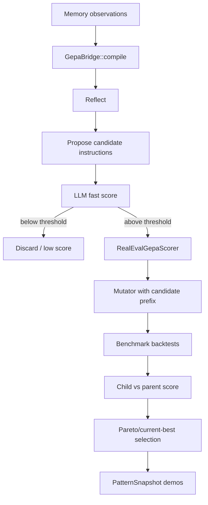

# DSPy Real GEPA Evaluation Design

## Context

`docs/plans/optimizer-selfplay-dspy-improvements.md` identifies Phase 4 as the next DSPy improvement: GEPA currently scores candidate instruction prefixes with another LLM call, so the optimizer can select prompts that sound aligned with observations but do not produce better strategies. The selected scope is real GEPA evaluation, not judge DSPy or anti-pattern memory.

Current code shape:

- `crates/xvision-engine/src/autooptimizer/gepa.rs` owns `GepaBridge`, which implements `DspyBridge::compile`.
- `GepaBridge::score_on_indices` currently asks an LLM to rate an instruction against observations and returns `ScoreWithFeedback`.
- `crates/xvision-engine/src/autooptimizer/dspy_flywheel.rs` calls the bridge after observation threshold, persists the compiled instruction as a pattern, and stores `SnapshotDemo.score` values for the compile set.
- `AutoOptimizerConfig` already has `gepa_candidates` and `gepa_generations`, but no real-eval switch or benchmark pool.
- Engine/dashboard must remain DSPy-crate-free. The real eval path must use existing engine abstractions and store opaque compile artifacts.

## Approved approach

Use a config-gated two-tier scorer:

1. Default remains unchanged: GEPA uses the existing LLM scoring path.
2. When `gepa_real_eval = true`, GEPA still uses LLM scoring as a fast cull.
3. Candidate instructions that survive the cull are scored by a real benchmark evaluator.
4. The benchmark evaluator injects the candidate instruction as the mutator prefix, runs the existing mutator/backtest path over fixed benchmark parent/scenario pairs, and converts child-vs-parent metrics into a bounded score.
5. Results are cached by instruction hash plus benchmark key so repeat candidates do not re-run backtests.
6. Real scores flow into `SnapshotDemo.score`, so existing pattern snapshots and flywheel telemetry continue to work.

## Non-goals

- Do not import `xvision-dspy`, `dspy-rs`, `rig-core`, or related heavy DSPy dependencies into `xvision-engine`, `xvision-cli`, or `xvision-dashboard`.
- Do not replace the existing LLM scorer by default.
- Do not implement judge-prompt DSPy or anti-pattern memory in this slice.
- Do not add standalone `xvn optimize` DSPy subcommands; the flywheel stays inside the AutoOptimizer cycle.
- Do not run broad live/provider-dependent tests as part of the implementation. Unit tests should use deterministic fakes.

## Configuration

Add fields to `AutoOptimizerConfig`:

- `gepa_real_eval: bool` — default `false`. Enables the real backtest scorer.
- `gepa_real_eval_min_llm_score: f64` — default `0.30`. Candidate must beat this fast score before paying for real eval.
- `gepa_benchmark_pool: Vec<GepaBenchmarkWindow>` — default empty. Each item names a parent strategy id/hash plus day and baseline windows or references an existing scenario/window pair.

Validation rules:

- `gepa_real_eval_min_llm_score` must be `0.0..=1.0`.
- `gepa_real_eval=true` requires at least one benchmark pool entry.
- Benchmark windows must obey the same date-span limits as AutoOptimizer windows.
- Empty benchmark pool is valid only when `gepa_real_eval=false`.

## Components

### `GepaInstructionScorer`

Add a small scorer boundary in `gepa.rs` or a new `gepa_eval.rs` module:

```rust
#[async_trait]
pub trait GepaInstructionScorer: Send + Sync {
    async fn score_instruction(
        &self,
        instruction: &str,
        observations: &[(String, String)],
        indices: &[usize],
        llm_scores: &ScoreWithFeedback,
        provenance: &mut Provenance,
    ) -> anyhow::Result<ScoreWithFeedback>;
}
```

Two implementations:

- `LlmGepaScorer` preserves the current behavior.
- `RealEvalGepaScorer` delegates first-pass filtering to `LlmGepaScorer`, then scores survivors through deterministic benchmark runs.

If Rust visibility becomes awkward because `ScoreWithFeedback` is private, keep the trait internal and expose only constructor/configuration methods on `GepaBridge`.

### Real eval score

For each benchmark pair:

```text
improvement = child_metric - parent_metric
normalized = improvement / max(0.01, abs(parent_metric))
score = clamp((normalized + 1.0) / 2.0, 0.0, 1.0)
```

Start with Sharpe as the metric because current snapshots store `metric_name = "delta_sharpe"`. The design can later expand to `Objective`, but the first implementation should keep one metric to avoid cross-objective ambiguity.

Aggregate across benchmark pairs by arithmetic mean. If a benchmark run fails, record feedback for that observation and assign a low score (`0.0`) for that benchmark instead of silently falling back to the LLM score.

### Cache

Add an in-memory cache for the lifetime of a compile pass:

```text
cache key = sha256(namespace + instruction + benchmark_pool_fingerprint)
```

If there is already a durable cache helper suitable for optimizer candidate evaluations, reuse it. Otherwise keep v1 in-memory only; correctness matters more than persistence in the first slice.

### Feedback text

The real scorer must return qualitative feedback strings because GEPA's later REFLECT step already consumes `best_feedback`.

Examples:

- `Real eval improved mean Sharpe by +0.12 across 3 benchmark windows.`
- `Real eval failed benchmark bear_2025: child Sharpe -0.08 vs parent +0.03.`
- `Skipped real eval: fast LLM score 0.18 below 0.30 threshold.`

## Data flow



## Testing plan

Write failing tests before implementation:

1. Config validation rejects `gepa_real_eval=true` with an empty benchmark pool.
2. Config validation rejects `gepa_real_eval_min_llm_score` outside `0.0..=1.0`.
3. `GepaBridge` with real eval enabled does not call the real scorer when the fast LLM score is below threshold.
4. `GepaBridge` with real eval enabled uses real scorer output to select between two candidates when both pass the fast tier.
5. Real scorer clamps negative and positive child-vs-parent metric deltas into `0.0..=1.0`.
6. Snapshot demos carry real scores instead of fast LLM scores when real eval is enabled.

Use deterministic fake scorers/backtest runners; no provider calls and no live data.

## Acceptance criteria

- Default config and current GEPA behavior stay backward compatible.
- `gepa_real_eval=true` changes winner selection only after a candidate passes the fast LLM tier.
- Real scores and feedback are visible in `SnapshotDemo` output.
- The engine/dashboard dependency boundary remains clean: no DSPy crate dependency leaks.
- Targeted tests pass for config validation, GEPA scorer routing, real-score math, and snapshot demo score propagation.
