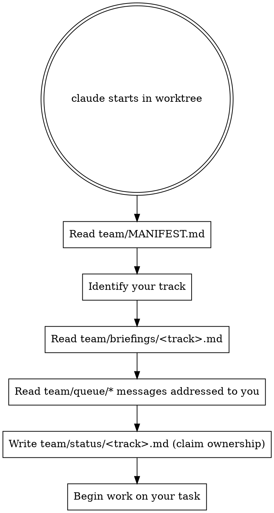

# xvision v1 — Team Coordination

This directory is the message bus for parallel Claude CLI sessions working on
the v1 deployable codebase. Multiple CLIs run in their own git worktrees and
coordinate through plain files committed to `main` (or to feature branches
that get merged regularly).

## Layout

```
team/
├── README.md           # this file — protocol
├── MANIFEST.md         # current phase + per-track ownership (single source of truth)
├── briefings/          # entry briefing for each track (read by the CLI on first run)
│   ├── engine-api.md
│   ├── broker-surface.md
│   └── frontend-foundation.md
├── status/             # per-track current status — each track owns its own file
│   └── <track>.md
└── queue/              # message bus — append-only, one file per message
    └── <from>__<utc-iso>__<topic>.md
```

## Workflow for each CLI on startup



## Message conventions

**Filename:** `<from-track>__<utc-iso-no-colons>__<topic>.md`
e.g. `engine-api__2026-05-10T143000Z__migration-001-reservation.md`

**Body header:**

```markdown
---
from: engine-api
to: [broker-surface, frontend-foundation]   # or `to: all`
topic: migration-001-reservation
created_at: 2026-05-10T14:30:00Z
ack_required: false
---

<message body>
```

**Acknowledgement:** when a recipient track has read and acted on a message
that has `ack_required: true`, it appends a reply file
`<recipient>__<utc>__ack-<original-topic>.md` referencing the original.
Otherwise no ack needed.

## Status file convention

Each track owns `team/status/<track>.md`. Overwrite it whenever your phase
changes. Body:

```markdown
---
track: engine-api
worktree: /Users/edkennedy/Code/xvision/.worktrees/engine-api
branch: feature/engine-api-foundation
phase: phase-2-api-types
last_updated: 2026-05-10T15:12:00Z
---

# What I'm doing right now

<one paragraph>

# Blocked on

<list of blockers, or "nothing">

# Next up

<list>
```

## Merge cadence

- Each track lands its work via PR back to `main` when its plan is complete.
- Long-running tracks rebase onto `main` daily to pick up team/ updates and
  cross-track changes.
- The MANIFEST is updated by whichever CLI lands a phase boundary (e.g.,
  Engine API Foundation merging unblocks all downstream tracks — that CLI
  edits MANIFEST.md to flip the phase).

## Conflict policy

- Two tracks must never edit the same source file in the same phase. If a
  conflict is unavoidable, send a queue message with `ack_required: true`
  and wait for the other track to ack before proceeding.
- Migration numbers (`xvision-engine/migrations/`) are reserved through
  `v1-shipping-plan.md` §"Migration reservations" — never claim a new number
  without checking that registry.
